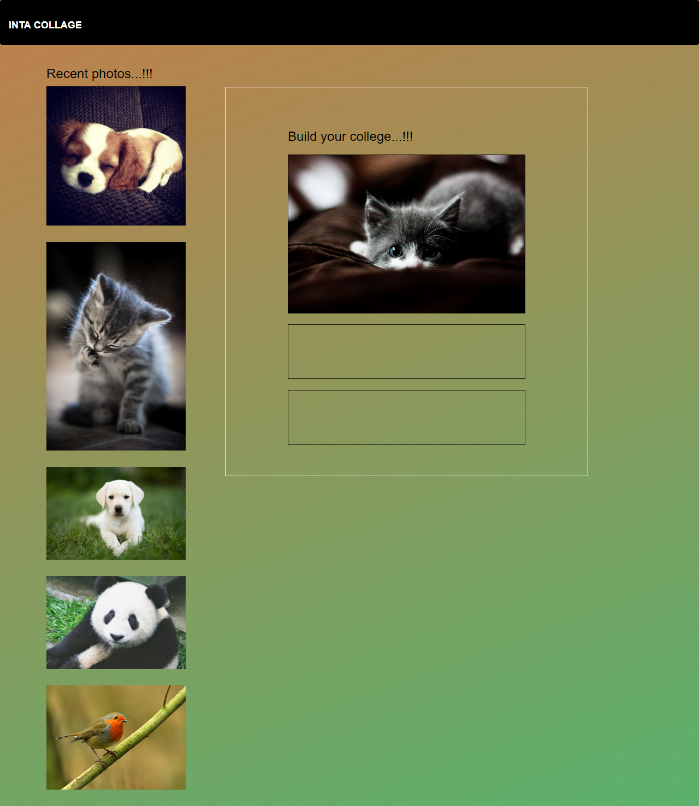

# INSTA COLLAGE

### Challenge drag and drop

#### Objetivo:

Hacer uso del API Drag and Drop de HTML5, creando una pagina web que nos permitirá hacer un collage con las imágenes de nuestro gusto.

#### Herramientas:

- Bootstrap 4
- CSS3
- HTML5
- api Drag And Drog
- JS ES6
- Jquery

#### Sobre el producto:

- Se validó el registro de usuario en la pagina.
- se utilizó el Api Drag and Drop de HTML5, para la funcionalidad del collage.

### Producto Elaborado

#### Log in

***

#### College

### Funcionalidad

#### Colaboradoras:

- Silvia Fuentes
- Eleyne Ramírez